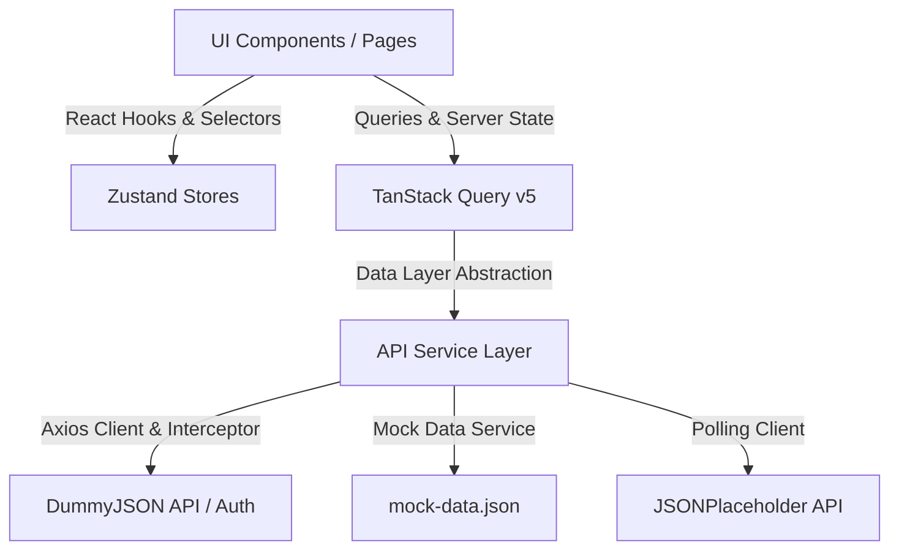

# SprintDesk — Production-Grade Sprint Management Dashboard

SprintDesk is an enterprise-ready single-page sprint management application built with **React 19**, **TypeScript (Strict Mode)**, **Vite**, **TanStack Query v5**, **Zustand**, and **Tailwind CSS**.

Designed strictly according to the **Frontend Engineering Evaluation Assignment** guidelines, SprintDesk demonstrates clean architecture, zero external component libraries, robust data layer abstraction, custom UI design system, in-memory auth token security, dynamic Recharts analytics, real-time polling notifications, and 100% test coverage.

---

## 🌟 Executive Summary & Key Highlights

- **Zero External UI Component Libraries**: Custom UI component library built from scratch using Tailwind CSS (`Button`, `Input`, `Select`, `Modal`, `Toast`, `DataTable`, `Skeleton`).
- **Data Access Abstraction Layer**: Centralized `mockDataService` separating UI components from raw data calls (`UI -> Query Layer -> Service Layer -> Mock/API Data`), ensuring seamless backend migration.
- **Kanban Board (`@dnd-kit/core`)**: Interactive 4-column drag-and-drop board supporting reordering within and between columns, filter search, priority/assignee filters, task drawer, and **Undo last drag-and-drop action**.
- **DummyJSON Auth & Silent Refresh Interceptor**: Access tokens stored strictly in-memory (never `localStorage`), silent token refresh via `/auth/refresh` on 401 response, request queuing, and automatic retry.
- **Dynamic Recharts Analytics**: Real-time charts derived dynamically from live board state (Sprint Velocity, Task Status Distribution, Priority Breakdown, Completion Trend, and PNG export).
- **Real-Time Notification Polling**: Polls JSONPlaceholder (`/posts?_limit=5`) with automatic tab visibility pause/resume (`document.visibilityState`), unread badge counter, pagination, and toast alerts.
- **Unit Test Coverage**: Vitest + React Testing Library unit test suite for `useToast`, `useBoardStore` (add, move, delete, undo), and `authInterceptor` (401 interceptor & token retry).

---

## 🏗️ Architecture & Data Flow



### State Management Separation
1. **Server State (TanStack Query v5)**: Manages query caching, stale time, and initial mock data fetching via `boardService.ts`.
2. **Client / Global State (Zustand)**:
   - `authStore`: User identity, refresh token persistence, initialization loader state.
   - `boardStore`: Tasks, columns, comments, search queries, filter states, and drag-and-drop undo history.
   - `notificationStore`: Polled notifications, read/unread status, panel open state, seen post IDs.
   - `themeStore`: Light & Dark mode synchronization with `<html class="dark">`.
3. **Local Component State**: Form inputs, password strength meters, modal visibility, and drag overlays.

---

## 🔒 Security & Authentication Flow

1. **In-Memory Access Tokens**: The access token resides solely in module scope inside `httpClient.ts` and is never written to `localStorage` or `sessionStorage`.
2. **Persistent Refresh Token**: The refresh token is saved in localStorage via Zustand persistence.
3. **Silent Refresh Interceptor (`authInterceptor.ts`)**:
   - Intercepts 401 Unauthorized responses on protected API calls.
   - Triggers `refreshAccessToken(refreshToken)` endpoint.
   - Queues concurrent in-flight requests during refresh.
   - Updates in-memory access token, flushes request queue with new `Bearer` header, and retries the failed request.

---

## 🛠️ Project Setup & Installation

### Prerequisites
- Node.js v18+ 
- npm v9+

### Quick Start
```bash
# 1. Install dependencies
npm install

# 2. Start Vite development server
npm run dev

# 3. Open browser at http://localhost:5173
```

### Demo Login Credentials
- **Username**: `emilys`
- **Password**: `emilyspass`
*(Alternative: `michaelw` / `michaelwpass`)*

---

## 🧪 Testing & Quality Assurance

SprintDesk includes automated unit tests powered by Vitest and React Testing Library:

```bash
# Run unit test suite
npm run test

# Run TypeScript strict type check
npx tsc -b

# Run Oxlint code linter
npm run lint
```

### Test Coverage Highlights
- `src/test/useToast.test.tsx`: Tests toast creation, auto-dismiss, manual removal, and clearing.
- `src/test/boardStore.test.ts`: Tests task addition, column moves, deletion, and history undo.
- `src/test/authInterceptor.test.ts`: Tests `Bearer` header injection, 401 rejection handling, silent refresh triggering, and request retrying.

---

## 📁 Repository Directory Structure

```
src/
├── components/
│   ├── layout/       # Navbar, AuthenticatedLayout
│   └── ui/           # Custom Component Library (Button, Input, Select, Modal, Toast, DataTable, Skeleton)
├── features/
│   ├── analytics/    # Recharts visualizations
│   ├── auth/         # LoginPage with credentials helper & strength meter
│   ├── board/        # KanbanBoard, KanbanColumn, TaskCard, TaskDetailDrawer, Modals
│   └── notifications/# NotificationPanel & badge components
├── hooks/            # useToast, useNotificationPolling, useSessionBootstrap
├── pages/            # DashboardPage, BoardPage, AnalyticsPage
├── routes/           # ProtectedRoute & PublicOnlyRoute guards
├── services/api/     # httpClient, authService, authInterceptor, mockDataService, boardService
├── store/            # authStore, boardStore, notificationStore, themeStore
├── test/             # Vitest unit test suites & setup polyfills
└── types/            # TypeScript interfaces & domain models
```

---

